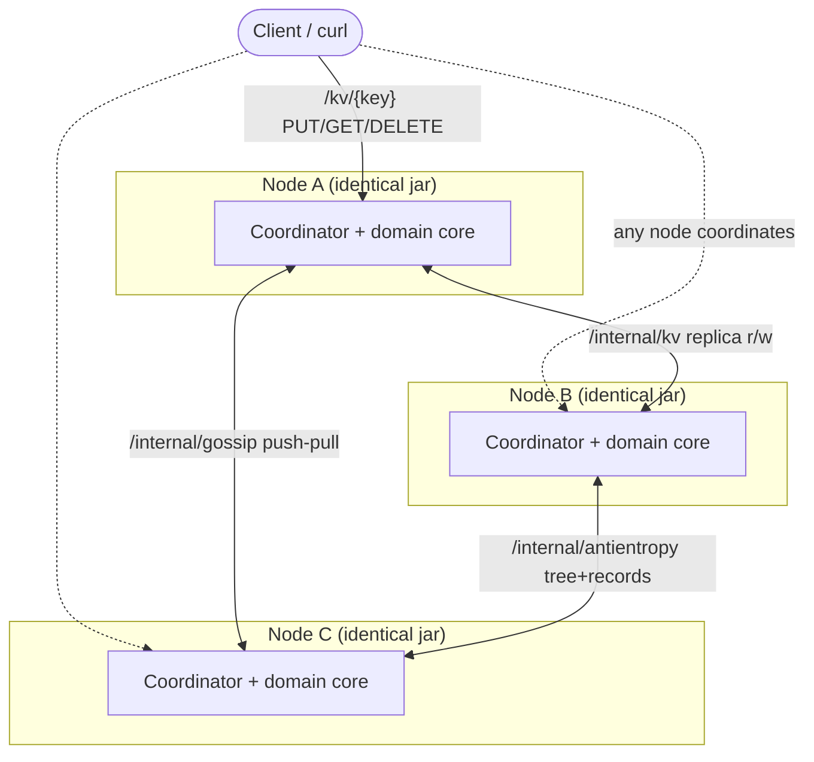
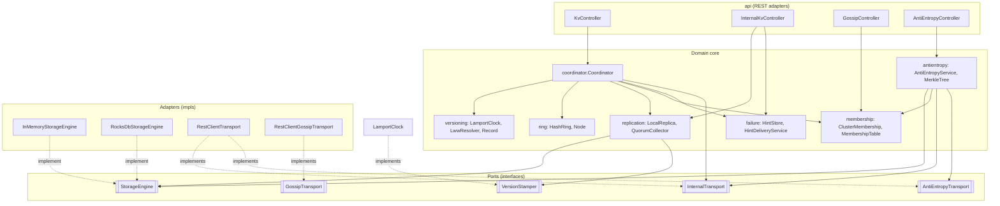
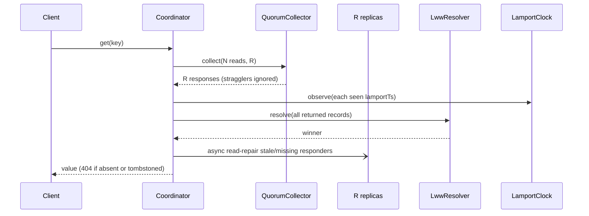
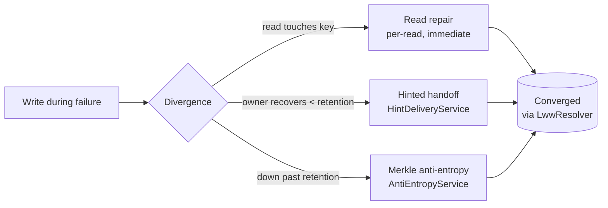

# Project Architecture Blueprint — mini-dynamo

> **Generated:** 2026-07-05 · **Commit:** `630e331` (branch `tier4/anti-entropy`) · **Scope:** whole repository
>
> A definitive reference for the architectural patterns in **mini-dynamo**, derived by reading the
> actual implementation (not the paper it reimplements). Use it to keep new work consistent with the
> patterns already established. The authoritative *feature/design* definition remains
> [`docs/spec.md`](spec.md); the working invariants remain [`CLAUDE.md`](../CLAUDE.md); per-tier
> tradeoffs remain [`DESIGN.md`](../DESIGN.md). This document describes *how the code is organized* and
> *how to extend it without breaking its invariants*.

---

## 1. Architecture Detection and Analysis

**Detected stack (auto):**

| Concern | Technology | Evidence |
| --- | --- | --- |
| Language | Java 21 (toolchain-pinned) | `build.gradle` → `JavaLanguageVersion.of(21)` |
| Framework | Spring Boot 3.4.1 | `build.gradle` plugins; `@SpringBootApplication` |
| Build | Gradle (single module, wrapper) | `settings.gradle` (`rootProject.name = 'mini-dynamo'`), `gradlew` |
| Web / REST | `spring-boot-starter-web` (Spring MVC, embedded Tomcat) | `@RestController` classes in `api/` |
| Node-to-node transport | Spring `RestClient` (synchronous HTTP/JSON) | `RestClientTransport`, `RestClientGossipTransport` |
| Persistence | RocksDB JNI (`rocksdbjni:9.7.3`) + in-memory `ConcurrentHashMap` | `storage/` package |
| Serialization | Jackson (via web starter) | `Record` JSON round-trip in `RocksDbStorageEngine` |
| Scheduling | Spring `@EnableScheduling` + `@Scheduled` | gossip / hint / anti-entropy / GC services |
| Config | `@ConfigurationProperties("minidynamo")` | `MiniDynamoProperties` (single binding point) |
| Tests | JUnit 5, Spring Boot Test, Testcontainers | `build.gradle` test deps; `src/test/...` |
| Packaging / deploy | Multi-stage Docker + Docker Compose (3-node) | `Dockerfile`, `docker-compose.yml` |

**Detected architectural pattern (auto):** a **peer-to-peer, share-nothing distributed system** with
**strict package-per-concept layering** and **interface seams at every I/O boundary**. There is no
client/server tier split *between* nodes — every node runs the identical jar and can coordinate any
request (**node symmetry**, an explicit invariant). Within a node, the code is a **hexagonal-ish
layering**: a thin REST adapter layer over a domain core (coordinator + versioning + ring), with
storage and transport as swappable ports.

The organizing principle is stated in `CLAUDE.md §6` and is faithfully implemented: **each Dynamo
concept lives in its own package so the code reads as a map of the paper.**

---

## 2. Architectural Overview

mini-dynamo is a leaderless, eventually-consistent key-value store. The guiding principles, all
observable in the code:

1. **Node symmetry.** No special roles. `MiniDynamoApplication` is the *only* entry point and every
   node boots it identically; behavior differs only by injected config (`NODE_ID`, `SEEDS`, …).
2. **Deterministic conflict resolution (LWW).** A single rule — `LwwResolver` — is the *only* place a
   conflict is ever decided: higher `lamportTs`, then higher `coordinatorId` lexicographically. It is
   reused at every convergence point (coordinator read, replica merge, read repair, anti-entropy,
   hint dedup). No vector clocks, no siblings.
3. **Logical time only.** `LamportClock` is the sole write-ordering source. Wall-clock time appears
   *only* for failure timing and GC age — never as a record timestamp (enforced by convention and
   documented at each use site).
4. **Availability via sloppy quorum + tunable `N/R/W`.** Writes/reads return at exactly `W`/`R`
   responses; `R+W>N` is validated at startup and fails fast.
5. **Interfaces at the seams.** `StorageEngine`, `VersionStamper`, `InternalTransport`,
   `GossipTransport`, `AntiEntropyTransport` are all interfaces with swappable implementations, so
   the domain logic never depends on RocksDB or HTTP directly.
6. **Immutability of values.** `Record`, `Hint`, `MemberInfo`, `MemberView`, `ReplicaWrite`, `Node`
   are all Java `record`s — value types with no mutable state.
7. **Convergence by layered anti-entropy.** Three mechanisms, weakest-to-strongest, all using the
   same LWW rule: read repair (per-read) → hinted handoff (per-recovery, bounded by retention) →
   Merkle anti-entropy (background, unbounded).

**Boundaries and how they are enforced:**

- *Package boundaries* map to Dynamo concepts and are enforced by convention + review (no module
  system / ArchUnit yet — see §16).
- *The domain never touches infrastructure directly* — enforced by the port interfaces and Spring
  constructor injection; concrete engines/transports are wired only in `config/`.
- *Invariants* (node symmetry, LWW determinism, quorum math, tombstone deletes) are enforced by
  `CLAUDE.md §2` as review gates and by targeted unit tests (§11).

**Hybrid/adaptation notes:** This is a *layered hexagonal* core wrapped in a *peer-to-peer topology*.
Unusually for a Spring app, there is **no service/repository/entity CRUD stack** — the "domain" is a
set of distributed-systems algorithms (ring walk, quorum collection, clock advance, tree diff), and
Spring is used only for DI, config binding, scheduling, and the HTTP adapter.

---

## 3. Architecture Visualization

### 3.1 High-level: a cluster of identical nodes



Any node accepts a client request and becomes the coordinator for it. Nodes talk to each other over
three internal HTTP channels: replica read/write, gossip, and anti-entropy.

### 3.2 Within one node: layers and dependency direction



Dependencies point **inward**: adapters depend on the core; the core depends on **port interfaces**;
concrete infrastructure implements those ports and is injected by Spring. The core never imports a
concrete engine or HTTP client.

### 3.3 Data flow: a client `PUT` (write path with sloppy quorum)

```mermaid
sequenceDiagram
    participant Cl as Client
    participant Kv as KvController
    participant Co as Coordinator
    participant Lc as LamportClock
    participant Ring as HashRing
    participant QC as QuorumCollector
    participant R1 as Replica (self / peer)
    participant Hs as HintStore

    Cl->>Kv: PUT /kv/key  (body)
    Kv->>Co: put(key, value)
    Co->>Lc: tick()  → lamportTs
    Co->>Ring: preferenceList(key, total)
    Note over Co: pick first N available clockwise;<br/>assign hints for DEAD intended owners
    Co->>QC: collect(N fan-out writes, W)
    par fan-out
        Co->>R1: writeReplica (LWW merge)
        R1->>Hs: store hint (if substitute)
    end
    QC-->>Co: completes at W acks
    Co-->>Kv: return (stragglers finish in background)
    Kv-->>Cl: 200 OK  (or 503 if quorum not met)
```

### 3.4 Data flow: a client `GET` (read path with read repair)



### 3.5 Convergence mechanisms (background)



---

## 4. Core Architectural Components

Each package is one Dynamo concept. For each: purpose, internal structure, interaction, and how to
extend it.

### 4.1 `ring` — placement
- **Purpose:** map keys to nodes via consistent hashing with virtual nodes; produce the preference
  list. No I/O, no Spring — pure functions.
- **Internal structure:** `HashRing` (immutable `TreeMap<Long,Node>`; `vnodes` positions per node,
  placed by `SHA-256(address#i)`), `Node` (`host:port` identity record with `parse`/`address`/`baseUrl`).
- **Interaction:** consumed by `Coordinator` (preference list) and `AntiEntropyService` (shared-key
  filter). `HashRing.hash(String)` is deliberately **reused** by `MerkleTree` for bucketing — one
  hash function across the system.
- **Evolution:** a membership change builds a *new* `HashRing` (immutable). `ClusterMembership`
  rebuilds lazily when the node-set version changes. To change placement, change only `HashRing`.

### 4.2 `versioning` — logical time & conflict resolution
- **Purpose:** the ordering and merge semantics that make replicas converge.
- **Internal structure:** `Record` (immutable value: `value`, `lamportTs`, `coordinatorId`,
  `deleted`), `LamportClock` (`AtomicLong`; `tick`/`observe`/`current`), `LwwResolver` (static, the
  single LWW rule + `sameVersion`), `VersionStamper` (interface over the clock).
- **Interaction:** every write path calls `clock.tick()`; every read/apply calls `clock.observe()`;
  every convergence point calls `LwwResolver`.
- **Evolution:** `VersionStamper` is an interface so the clock is swappable/testable. **Do not** add
  a second resolution rule — `LwwResolver` is intentionally the only one (invariant).

### 4.3 `storage` — local persistence port
- **Purpose:** pluggable local durability; LWW-atomic merge.
- **Internal structure:** `StorageEngine` interface (`get`/`put`/`merge`/`entries`/`remove`),
  `InMemoryStorageEngine` (`ConcurrentHashMap.merge` for atomic RMW), `RocksDbStorageEngine`
  (Jackson-serialized records; coarse `synchronized` merge — flagged as an intentional shortcut).
- **Interaction:** used by `LocalReplica`, `AntiEntropyService`, `TombstoneGcService`.
- **Evolution:** add an engine by implementing `StorageEngine` and selecting it in `StorageConfig`.
  `merge` must stay atomic (that is where LWW-under-concurrency correctness lives). `remove` is for
  GC only — never the write path (deletes are tombstones).

### 4.4 `replication` — replica I/O & quorum
- **Purpose:** apply writes/reads to a replica; collect a quorum; define the node-to-node transport port.
- **Internal structure:** `LocalReplica` (the *only* write entry into local storage: `observe` then
  `merge`), `QuorumCollector` (completes at threshold, fails fast with `QuorumNotMetException` when
  the threshold becomes unreachable, ignores stragglers), `InternalTransport` (port), `ReplicaWrite`
  (write body DTO), `RestClientTransport` (HTTP impl, also implements `AntiEntropyTransport`).
- **Interaction:** `Coordinator` fans out through `InternalTransport`/`LocalReplica`;
  `InternalKvController` applies inbound writes through `LocalReplica`.
- **Evolution:** replace HTTP with gRPC by adding an `InternalTransport` impl — no call-site changes.

### 4.5 `coordinator` — the per-request state machine
- **Purpose:** orchestrate a single client request: stamp, route (sloppy), fan out, collect quorum,
  resolve, repair. The one stateful-per-request component (though itself a singleton bean).
- **Internal structure:** `Coordinator` only. Reads and writes share the clockwise-node selection and
  hint-assignment helpers. `NodeRead` is a private record for read responses.
- **Interaction:** the hub — depends on `membership`, `replication`, `failure`, `versioning`. Invoked
  by `KvController`.
- **Evolution:** new request semantics (e.g. conditional writes) would extend `Coordinator`; keep the
  "return at W/R, background the rest" contract intact.

### 4.6 `membership` — gossip & failure detection
- **Purpose:** maintain the live view of the cluster and the health each node routes on.
- **Internal structure:** `MembershipTable` (`ConcurrentHashMap` of `MemberInfo`; incarnation-then-
  heartbeat merge; `sweep` ages ALIVE→SUSPECT→DEAD), `GossipService` (`@Scheduled` push-pull round to
  a random peer), `ClusterMembership` (wraps the table + lazily-rebuilt `HashRing`; validates
  `R+W>N`), `MemberInfo`/`MemberView`/`MemberState` (records/enum), `GossipTransport` (port) +
  `RestClientGossipTransport`.
- **Interaction:** `Coordinator` and `AntiEntropyService` read the ring and `isAvailable`;
  `GossipController` drives inbound exchanges.
- **Evolution:** the design note calls out a phi-accrual detector as a future swap; it would replace
  the age-threshold logic in `sweep`.

### 4.7 `failure` — hinted handoff
- **Purpose:** keep writes durable when an intended owner is down, and heal on recovery.
- **Internal structure:** `Hint` (record), `HintStore` (`ConcurrentHashMap` keyed `owner|key`, LWW
  dedup, retention drop — in-memory, flagged), `HintDeliveryService` (`@Scheduled`; delivers when
  owner is ALIVE, drops on success, drops expired regardless).
- **Interaction:** `Coordinator`/`InternalKvController` store hints on substitute writes;
  `HintDeliveryService` uses `InternalTransport` to hand off.
- **Evolution:** persist the hint store if losing hints on a substitute restart matters (anti-entropy
  is the current backstop).

### 4.8 `antientropy` — Merkle sync & tombstone GC
- **Purpose:** close the convergence gap that read-repair and hints miss.
- **Internal structure:** `MerkleTree` (heap-array tree over 256 hash buckets; leaf digest hashes
  keys + *versions* only, not payload; `differingBuckets` short-circuits matching subtrees),
  `AntiEntropyService` (`@Scheduled`; per available peer: build tree over shared keyspace, fetch
  peer's tree, diff, exchange differing buckets, LWW-reconcile both directions), `AntiEntropyTransport`
  (port), `TombstoneGcService` (`@Scheduled`; hard-removes tombstones older than retention, age from
  first-seen).
- **Interaction:** `AntiEntropyController` serves tree/records to peers; reconciliation pulls locally
  via `LocalReplica` and pushes via `InternalTransport`.
- **Evolution:** incremental (vs rebuilt-per-round) trees and single-random-peer selection are the
  documented upgrade paths for larger clusters/keyspaces.

### 4.9 `api` — REST adapters
- **Purpose:** translate HTTP ↔ domain calls. Thin; no business logic beyond status mapping.
- **Internal structure:** `KvController` (client-facing `/kv`; 200/404/503), `InternalKvController`
  (`/internal/kv` replica r/w; 200/204), `GossipController` (`/internal/gossip`), `AntiEntropyController`
  (`/internal/antientropy`).
- **Evolution:** a new internal protocol = a new `/internal/*` controller + a port interface.

### 4.10 `config` — wiring & validation
- `MiniDynamoProperties` (the single `@ConfigurationProperties` binding, with defaulting in the
  compact constructor), `StorageConfig`/`MembershipConfig`/`CoordinationConfig` (bean selection:
  engine choice, membership table construction with boot-time incarnation, bounded executor + timed
  `RestClient`).

---

## 5. Architectural Layers and Dependencies

Layered core with ports; dependencies point inward.

| Layer | Packages | May depend on | Must NOT depend on |
| --- | --- | --- | --- |
| **Adapter (inbound)** | `api` | domain core, DTOs | concrete engines/transports |
| **Domain core** | `coordinator`, `membership`, `failure`, `antientropy`, `replication` (logic), `ring`, `versioning` | port interfaces, other core, value types | Spring MVC, RocksDB, RestClient |
| **Ports** | `StorageEngine`, `VersionStamper`, `InternalTransport`, `GossipTransport`, `AntiEntropyTransport` | value types only | any impl |
| **Adapter (outbound)** | `RestClientTransport`, `RestClientGossipTransport`, `InMemory/RocksDb…` | ports, value types | domain orchestration |
| **Composition** | `config`, `MiniDynamoApplication` | everything (wiring only) | — |

**Dependency rule:** the domain core depends on **interfaces**, never implementations. Verified by
inspection of imports — e.g. `Coordinator` imports `InternalTransport` (port), never `RestClientTransport`;
`LocalReplica` imports `StorageEngine`, never a concrete engine.

**Injection mechanism:** Spring **constructor injection** throughout (no field injection, no
`@Autowired` on fields). Concrete beans are chosen in `config/` — `StorageConfig` picks the engine
from `storage-engine`; `CoordinationConfig` supplies the executor and `RestClient`. This is the layer
seam: swapping an implementation is a one-line change in `config/`.

**Circular dependencies / violations:** none observed. `RestClientTransport` implementing *two* ports
(`InternalTransport` + `AntiEntropyTransport`) is a deliberate co-location of the HTTP concern, not a
cycle. The only slightly wide dependency is `Coordinator` (the hub), which is inherent to a
coordinator pattern.

---

## 6. Data Architecture

- **Domain model:** deliberately minimal. The single persisted aggregate is `Record`
  `(byte[] value, long lamportTs, String coordinatorId, boolean deleted)`. Keys are opaque `String`s;
  values are opaque byte payloads. There is **no relational/entity model** — this is a KV store.
- **Identity/versioning:** a record's *version* is `(lamportTs, coordinatorId)`; `deleted` marks a
  tombstone. Equality that matters for convergence is `LwwResolver.sameVersion`, not `Record.equals`
  (which is identity-based on the `byte[]` — explicitly flagged in `Record`'s javadoc).
- **Access pattern:** a **port + adapter** (repository-equivalent) via `StorageEngine`. The
  distinguishing operation is `merge(key, incoming, resolver)` — an **atomic** read-modify-write that
  applies LWW, so concurrent replica writes to one key can't lose an update. `put` is a raw overwrite
  used only where the caller already holds the winner.
- **Serialization/mapping:** Jackson maps `Record` ↔ JSON for both the RocksDB engine and every
  internal HTTP call. One representation, everywhere.
- **Anti-entropy digest as derived data:** `MerkleTree` is a *derived* view over the store, hashing
  **keys + versions only** (never payload) into 256 buckets — because only the version decides LWW.
- **Caching:** none, by policy ("no premature optimization"). The only cached derivation is the
  `HashRing`, rebuilt lazily on node-set change.
- **Validation:** startup-time (`R+W>N`, required `node-id`, `host:port` parse); request-time is thin
  (raw body bytes accepted for any content type).

---

## 7. Cross-Cutting Concerns Implementation

### Authentication & Authorization
**None, by explicit scope** (`CLAUDE.md §9`: no auth/authz/TLS). All endpoints — client and internal
— are open. The `/internal/*` vs `/kv` split is a *convention*, not a security boundary. Do not add a
security layer without updating the spec first.

### Error Handling & Resilience
This is the system's core competency, implemented as data-flow rather than exceptions where possible:
- **Quorum failure:** `QuorumCollector` fails fast with `QuorumNotMetException` the moment the
  threshold becomes unreachable → `KvController` `@ExceptionHandler` maps to **503**.
- **Straggler tolerance:** the collector returns at `W`/`R`; slow replicas keep running in the
  background for durability and read repair (`CompletableFuture` fan-out on a bounded pool).
- **Transport failure vs. absence:** an unreachable replica *throws* (a failed future); an absent key
  is a successful `Optional.empty()` / HTTP 204. This distinction is documented on `InternalTransport`
  and honored by `InternalKvController` (204 for absent) — a failure must never look like "not found".
- **Fast failure of dead replicas:** `internalRestClient` uses 1s connect / 2s read timeouts so an
  unreachable peer frees its fan-out thread quickly.
- **Graceful degradation:** sloppy quorum + hinted handoff keep the system write-available through
  node loss; the three-layer anti-entropy stack guarantees eventual convergence.

### Logging & Monitoring
- **SLF4J** throughout. Convention (`CLAUDE.md §7`): **INFO** for lifecycle events (member join/state
  change, hint stored/delivered, tombstone GC, anti-entropy reconciled), **DEBUG** for per-request /
  best-effort failures (gossip/read-repair/hint-delivery failures that will retry). Payloads are
  never logged at INFO.
- **Metrics:** Micrometer/Prometheus is listed as *deferred optional* (Tier 4) and is **not** wired.

### Validation
- **Startup validation** is where correctness is guarded: `ClusterMembership` throws on `R+W ≤ N`;
  `MembershipConfig` throws on missing `node-id`; `Node.parse` and `MerkleTree` constructor reject
  malformed input (bad `host:port`, non-power-of-two buckets).
- **Request validation** is intentionally thin — the store accepts arbitrary bytes for any key.

### Configuration Management
- **Single source:** `MiniDynamoProperties` (`@ConfigurationProperties("minidynamo")`). No scattered
  `@Value`. Defaults live in the record's compact constructor *and* `application.yml` (belt-and-braces).
- **Environment-driven:** every property maps to an env var (`NODE_ID`, `SEEDS`, `MINIDYNAMO_N`, …),
  so Docker Compose configures each node purely through `environment:`.
- **Secrets / feature flags:** none (out of scope). `storage-engine` is the one behavior toggle.

---

## 8. Service Communication Patterns

- **Boundaries:** every node exposes one client surface (`/kv/**`) and three internal surfaces
  (`/internal/kv/**`, `/internal/gossip`, `/internal/antientropy/**`).
- **Protocol/format:** HTTP/1.1 + JSON (Jackson) for *all* inter-node calls. Chosen for legibility;
  kept behind transport interfaces so gRPC can replace it later without touching call sites.
- **Sync vs async:**
  - Node-to-node calls are **synchronous** (`RestClient`).
  - The coordinator's *fan-out* is **asynchronous & concurrent** (`CompletableFuture.supplyAsync` on a
    bounded 16-thread pool), gated by `QuorumCollector`.
  - Background convergence (gossip, hint delivery, anti-entropy, GC) is **scheduled** (`@Scheduled`,
    all on the gossip interval).
- **Discovery:** static seed list (`SEEDS`) bootstraps membership; gossip then maintains the live set.
  Node identity = hostname (Docker service name) + port, so no external service registry.
- **Versioning strategy:** none yet — internal endpoints are unversioned. Because every node runs the
  identical jar, wire compatibility is guaranteed by deployment, not by API versioning.
- **Resilience in communication:** short timeouts, fail-fast quorum, retry-next-round for gossip and
  hint delivery, best-effort (log-and-continue) for read repair and anti-entropy.

---

## 9. Technology-Specific Architectural Patterns

### Java / Spring Boot patterns detected
- **Application container & bootstrap:** one `@SpringBootApplication` with `@EnableScheduling` and
  `@EnableConfigurationProperties(MiniDynamoProperties.class)`. Embedded Tomcat; the "cluster" is N
  instances of the same jar with different env.
- **Dependency injection:** constructor injection exclusively; `@Component`/`@RestController` for
  stereotypes; `@Configuration`+`@Bean` for infrastructure that needs construction logic (executor,
  timed `RestClient`, engine selection, membership table).
- **Configuration binding:** immutable `record`-based `@ConfigurationProperties` — the modern Spring
  Boot idiom, with defaulting in the compact constructor.
- **Scheduling as the concurrency backbone for background work:** `@Scheduled(fixedDelayString =
  "${minidynamo.gossip-interval-ms:1000}")` drives gossip, hint delivery, anti-entropy, and GC — all
  package-private methods split from their `@Scheduled` wrappers so tests can drive one round
  deterministically.
- **AOP / transactions:** none. No `@Transactional` — atomicity is handled at the storage-engine
  `merge` level, not by a transaction manager. This is a deliberate fit for a KV store.
- **HTTP client:** Spring 6 `RestClient` (synchronous), configured with an explicit
  `SimpleClientHttpRequestFactory` for timeouts.
- **Value types:** Java 21 `record`s for all DTOs and domain values; `AtomicLong` for the clock and
  heartbeat counters; `ConcurrentHashMap` for all shared mutable maps.

---

## 10. Implementation Patterns

### Interface (port) design
Ports are **narrow and behavior-specific**, not generic CRUD. `AntiEntropyTransport` is kept separate
from `InternalTransport` "so the two concerns evolve independently," even though one class implements
both. Each interface documents its **failure contract** (throw on transport failure; empty on
absence) — the contract, not just the signature, is the seam.

### Service implementation
- Services are **stateless singletons** except for the small concurrent state they explicitly own
  (`LamportClock` counter, `MembershipTable` maps, `HintStore` map, `TombstoneGcService.firstSeen`),
  each with its concurrency strategy documented in the class javadoc.
- The **`@Scheduled` method delegates to a package-private, time-parameterized method**
  (`gc(now)`, `syncWith(peer)`, `round()`) — the standard testability pattern here.

### Repository (storage) implementation
- `merge` is the correctness-critical operation and each engine implements it atomically in its own
  idiom (`ConcurrentHashMap.merge` vs a `synchronized` RMW). Note the argument-order care: the
  resolver is always called `resolver.apply(incoming, current)` — consistent across engines.
- A **shared contract test** (`StorageEngineContract`, extended by both engine tests) pins behavior
  equivalence across implementations.

### Controller / API implementation
- Controllers are **maximally thin**: parse path/body → one domain call → map to status. Business
  rules (LWW, quorum, routing) live entirely in the core.
- Status mapping is centralized per controller via `@ExceptionHandler` (e.g. `QuorumNotMetException`
  → 503).
- Raw `InputStream` body reading + disabled form-content filter lets any `Content-Type` (incl.
  `curl -d`) reach the handler as opaque bytes.

### Domain value implementation
- Values are `record`s with **static factory methods** for intent (`Record.value(...)`,
  `Record.tombstone(...)`). Business rule enforcement (LWW ordering) is a **static pure function**
  (`LwwResolver`), reused rather than reimplemented at each call site.

---

## 11. Testing Architecture

- **Frameworks:** JUnit 5 + Spring Boot Test; Testcontainers for the cluster integration test.
- **Boundaries / pyramid:**
  - *Unit* (the bulk): per-concept, deterministic, using the in-memory engine and fixed seeds —
    `HashRingTest`, `LwwResolverTest`, `LamportClockTest`, `QuorumCollectorTest`, `MembershipTableTest`,
    `GossipServiceTest`, `HintStoreTest`, `MerkleTreeTest`, `CoordinatorTest`, `KvControllerTest`.
  - *Contract:* `StorageEngineContract` runs the same suite against `InMemory` and `RocksDb` engines.
  - *Property:* `ConvergencePropertyTest` applies a random sequence of writes/deletes across nodes
    with induced failures and asserts every key converges on all replicas once quiesced (the invariant
    the whole system exists to satisfy).
  - *Integration:* `ClusterIntegrationTest` stands up the 3-node Docker Compose cluster via
    Testcontainers (W=2 write→R=2 read, node kill + sloppy quorum + hinted handoff, read-repair
    convergence, partition heal).
- **Test doubles:** ports are mocked/faked at the interface (fake `InternalTransport`/`GossipTransport`
  in unit tests); no mocking framework needed for value logic.
- **Determinism rule (enforced by convention, `CLAUDE.md §8`):** fixed seeds/node lists, no wall-clock
  ordering assertions; time-dependent services expose a time-parameterized method for tests.
- **Known environment caveat (from memory + README):** Testcontainers auto-skips when it can't reach
  Docker Desktop's engine API on this Mac; the Tier gate is then verified manually via `make up` +
  `make demo`. Don't rabbit-hole on TC failures here.

---

## 12. Deployment Architecture

- **Topology:** `docker-compose.yml` defines a 3-node cluster (`node1/2/3`), each building the same
  `Dockerfile`, host ports `8081–8083 → 8080`. Service names double as node ids / network aliases, so
  `SEEDS=node1:8080,node2:8080,node3:8080` resolves over the compose network.
- **Image:** multi-stage `Dockerfile` — `temurin:21-jdk` builds `bootJar` (tests skipped in-image),
  `temurin:21-jre` runs it. Self-contained so both compose and the Testcontainers test build from the
  repo.
- **Environment-specific config:** entirely via env vars mapped to `MiniDynamoProperties`. The compose
  file sets `STORAGE_ENGINE: inmemory` for demos; RocksDB (the default) persists under `data/<node>`.
- **Runtime dependency resolution:** static seeds → gossip-maintained membership; no external registry,
  DB, or coordination service. Fully self-contained.
- **Operational flows** wrapped in the `Makefile`: `make up/down/test/kill-node/demo/demo-resilience`.
  JDK 21 is pinned for Gradle via `JAVA_HOME` detection.
- **Orchestration/cloud:** none beyond Compose (out of scope: multi-region, cross-DC).

---

## 13. Extension and Evolution Patterns

### Feature addition — where things go
| You want to add… | Put it in… | Pattern to follow |
| --- | --- | --- |
| A new storage backend | `storage/` + `StorageConfig` | implement `StorageEngine` (atomic `merge`!), select by config |
| A new inter-node transport (gRPC) | new impl of `InternalTransport`/`GossipTransport`/`AntiEntropyTransport` | swap the bean; **no** call-site changes |
| A new internal protocol | new `/internal/*` controller + a port interface | mirror `AntiEntropyController` + `AntiEntropyTransport` |
| A new background reconciliation job | new `@Scheduled` `@Component` | split scheduled method from a time-parameterized, package-private core for tests |
| A new failure detector | replace `MembershipTable.sweep` logic | keep the `MemberState` contract |
| A new config knob | `MiniDynamoProperties` + `application.yml` + env mapping | **flag it** — no config keys beyond the spec table without approval |

### Modification — safety rules
- **Never break a `CLAUDE.md §2` invariant** (node symmetry, LWW-only, LWW determinism, Lamport
  advance rule, quorum math, sloppy direction, tombstone deletes). If a change seems to require it,
  **stop and ask**.
- **Backward compatibility on the wire** is guaranteed by identical-jar deployment, not versioning —
  so a change to any DTO (`Record`, `MemberView`, `ReplicaWrite`) must be rolled out cluster-wide.
- **Tier discipline:** don't start a tier before the previous tier's acceptance tests are green.

### Integration — anti-corruption
The port interfaces *are* the anti-corruption layer: external concerns (HTTP, RocksDB) are adapted at
the edge and never leak their types into the domain. A new external system should enter through a new
port + adapter, not by importing its client into the core.

---

## 14. Architectural Pattern Examples

### Layer separation — core depends on a port, not an impl
```java
// coordinator/Coordinator.java — depends on the InternalTransport interface
private final InternalTransport transport;      // port, not RestClientTransport
...
private void writeReplica(Node node, String key, Record record, List<String> hintFor) {
    if (node.equals(membership.self())) {
        local.apply(key, record);               // local path: no network
        ...
    } else {
        transport.write(node, key, record, hintFor);   // remote path: through the port
    }
}
```

### The single LWW rule, reused everywhere
```java
// versioning/LwwResolver.java — the ONE place a conflict is decided
public static boolean wins(Record candidate, Record incumbent) {
    if (candidate.lamportTs() != incumbent.lamportTs()) {
        return candidate.lamportTs() > incumbent.lamportTs();   // higher timestamp
    }
    return candidate.coordinatorId().compareTo(incumbent.coordinatorId()) > 0;  // tiebreak
}
```
Called from: coordinator read resolution, `LocalReplica.apply` (via `merge`), read repair, anti-entropy
reconciliation, and `HintStore` dedup — never reimplemented.

### Quorum completion (return at threshold, ignore stragglers, fail fast)
```java
// replication/QuorumCollector.java
if (error != null) {
    int f = failed.incrementAndGet();
    if (total - f < threshold) {            // can no longer reach quorum → fail now
        result.completeExceptionally(new QuorumNotMetException(threshold, total - f, ...));
    }
} else {
    successes.add(value);
    if (succeeded.incrementAndGet() == threshold) {
        result.complete(List.copyOf(successes));   // done at exactly W/R
    }
}
```

### Testable scheduled job (scheduled wrapper → time-parameterized core)
```java
// antientropy/TombstoneGcService.java
@Scheduled(fixedDelayString = "${minidynamo.gossip-interval-ms:1000}")
public void gc() { gc(System.currentTimeMillis()); }

void gc(long now) { ... }   // package-private: a test drives GC at a controlled time
```

### Merkle short-circuit (the anti-entropy fast path)
```java
// antientropy/MerkleTree.java — matching subtrees are skipped at their ancestor
private static void descend(long[] a, long[] b, int i, int buckets, List<Integer> diffs) {
    if (a[i] == b[i]) return;                 // identical subtree → skip entire range
    if (i >= buckets) { diffs.add(i - buckets); return; }   // differing leaf bucket
    descend(a, b, 2 * i, buckets, diffs);
    descend(a, b, 2 * i + 1, buckets, diffs);
}
```

---

## 15. Architectural Decision Records

### ADR-1 — Last-write-wins over vector clocks
- **Context:** conflict resolution for concurrent writes in a leaderless store.
- **Decision:** LWW on `(lamportTs, coordinatorId)` — a total order.
- **Alternatives:** vector clocks + sibling reconciliation (real Dynamo).
- **Consequences:** (+) every replica deterministically converges to one record; simple client
  contract. (−) concurrent writes can silently lose an update; no sibling is surfaced. Accepted as the
  simplification for a single-DC learning artifact. (`DESIGN.md`)

### ADR-2 — Lamport logical clock, no wall clock for ordering
- **Context:** need a write-ordering timestamp without a global clock.
- **Decision:** a per-node Lamport counter; `observe` before every `tick`, so a write is stamped above
  anything seen. Wall clock used *only* for failure timing and GC age.
- **Consequences:** (+) causal monotonicity without clock sync; (−) ordering is logical, not real-time;
  ties need the `coordinatorId` tiebreak.

### ADR-3 — Sloppy quorum + hinted handoff for write availability
- **Context:** stay write-available when intended replicas are down.
- **Decision:** extend the preference list clockwise to the next healthy nodes; substitutes hold a
  hint for the intended owner and hand off on recovery.
- **Consequences:** (+) writes survive node loss; (−) replicas diverge temporarily; requires the
  convergence stack (ADR-5).

### ADR-4 — Ports at every I/O seam (storage, transport, clock)
- **Context:** keep distributed-systems logic independent of infrastructure and testable.
- **Decision:** `StorageEngine`, `VersionStamper`, `InternalTransport`, `GossipTransport`,
  `AntiEntropyTransport` as interfaces; concretes wired in `config/`.
- **Consequences:** (+) engines/transports swap without touching the core; deterministic unit tests;
  (−) more types; one class (`RestClientTransport`) implements two ports for cohesion.

### ADR-5 — Three-layer convergence, all via the same LWW rule
- **Context:** read repair only fixes read keys; hinted handoff only covers recovery within retention.
- **Decision:** add Merkle-tree anti-entropy for divergence that outlives hints; all three layers
  resolve with the identical `LwwResolver`.
- **Consequences:** (+) guaranteed eventual convergence; (−) background cost. Mitigated by the
  root-hash gate making the in-sync case cheap. (`DESIGN.md`)

### ADR-6 — Naive age-based tombstone GC
- **Context:** tombstones must persist long enough for LWW, then be reclaimed.
- **Decision:** hard-remove tombstones older than `tombstone-gc-ms` (default 24h), age from first-seen.
- **Consequences:** (+) simple; safe in practice since retention ≫ convergence time. (−) theoretically
  can resurrect a key if GC'd before a lagging replica sees the tombstone; a fully safe GC would
  require all-replica acknowledgment. Documented as the upgrade path. (`DESIGN.md`)

### ADR-7 — Single Gradle module, Spring Boot, HTTP/JSON transport
- **Context:** a cluster is N identical jars.
- **Decision:** one bootJar; RestClient HTTP/JSON between nodes behind transport interfaces.
- **Consequences:** (+) trivial deploy (same image, different env), legible wire format; (−) HTTP/JSON
  overhead — accepted, gRPC is a later swap via the ports.

---

## 16. Architecture Governance

- **Invariants as review gates:** `CLAUDE.md §2` enumerates non-negotiable invariants; §10 says to
  *stop and ask* rather than break one. This is the primary governance mechanism.
- **Tier discipline:** work proceeds in spec tier order; "a tier is not done until its acceptance
  criteria pass with green tests." README tracks tier status.
- **Definition of done:** compiles, all tests green, respects the current tier gate, and updates
  `README.md`/`DESIGN.md` if architecture changed.
- **Config governance:** no config keys/endpoints/dependencies beyond the spec + `CLAUDE.md §5` table
  without flagging in the PR.
- **Executable governance (what enforces it automatically):** the shared `StorageEngineContract`
  (engine equivalence), the `ConvergencePropertyTest` (the core invariant), and the invariant-specific
  unit tests (quorum-at-threshold, LWW tiebreak, Lamport monotonicity, hint lifecycle, sloppy
  extension).
- **Gap:** there is **no automated architecture/dependency-fitness check** (e.g. ArchUnit, module
  boundaries, Spotless). Layer/package rules are enforced by convention and review only — the most
  likely place for drift. Adding ArchUnit rules ("`coordinator` must not depend on `RestClient*`",
  "`api` must not depend on concrete engines") would make §5's rules executable.

---

## 17. Blueprint for New Development

### Development workflow by feature type
- **New algorithm variant (detector, resolver-adjacent, placement):** it lives in the owning core
  package, behind the existing interface if there is one. Add deterministic unit tests with fixed
  seeds first. Never introduce a second conflict-resolution path.
- **New persistence/transport backend:** implement the port, select it in `config/`, extend the
  relevant contract test. Zero changes to the core.
- **New background reconciliation:** a `@Scheduled @Component` on the gossip interval, with the
  scheduled method delegating to a time-parameterized package-private method for tests.
- **New client capability:** extend `Coordinator` (keep "return at W/R, background the rest"), add a
  thin `KvController` mapping, map new failure modes via `@ExceptionHandler`.

### Implementation templates
- **Value type:** a Java `record` with static intent factories (see `Record`).
- **Port:** a narrow interface documenting its *failure contract* (throw vs empty), plus a
  `RestClient`-based adapter and a fake for tests.
- **Scheduled service:** `@Scheduled` wrapper + package-private core; `@Component`; concurrency
  strategy documented in the class javadoc.
- **File organization:** one Dynamo concept per package (`CLAUDE.md §6`); constructor injection; no
  field `@Value`.
- **Deliberate shortcut:** mark with a `ponytail:`-style comment naming the ceiling and the upgrade
  path (see `HintStore`, `RocksDbStorageEngine.merge`, `TombstoneGcService`) — the established idiom
  here.

### Common pitfalls to avoid
- Reimplementing LWW instead of calling `LwwResolver` (breaks determinism if it drifts).
- Using wall-clock time as a record timestamp (only Lamport orders records).
- Hard-deleting on the write path (deletes are tombstones; `remove` is GC-only).
- Letting a transport *failure* look like key *absence* (they are distinct — 204/empty vs throw).
- Blocking the coordinator on all N replicas (return at W/R; background the rest).
- Adding a config key, endpoint, or dependency not in the spec/§5 table without flagging.
- Assuming Testcontainers runs here — it may auto-skip; verify via `make up` + `make demo`.
- Adding an interface with a single implementation *speculatively* — the existing ports exist because
  each has a real second impl or a test fake; don't add ports without that justification.

### Keeping this blueprint current
Regenerate/revise when: a new tier lands, a port or package is added/removed, an invariant or config
key changes, or `DESIGN.md` gains a new ADR. This document was generated from commit `630e331`; treat
it as stale if the package list in §4 no longer matches `src/main/java/com/minidynamo/`.
