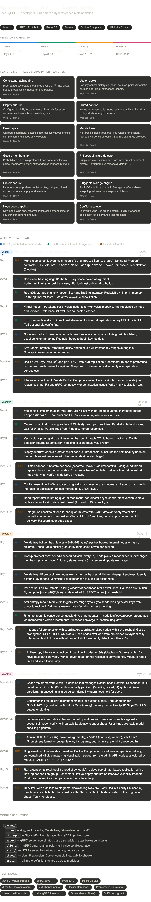

# Mini-Dynamo: Project Timeline & Feature List

**Stack:** Java 21 · gRPC / Protobuf · RocksDB · Maven · Docker Compose · JUnit 5 + Chaos  
**Team:** 2 developers · 4 weeks  
**Reference:** DeCandia et al., "Dynamo: Amazon's Highly Available Key-value Store," SOSP 2007

---

## Developer legend

| Label | Role |
|---|---|
| Dev A | Distributed systems lead — ring, clocks, Merkle tree, failure detection |
| Dev B | Infrastructure & storage lead — gRPC, persistence, gossip, benchmarks |
| Both | Paired work or integration sessions |

---

## Feature list

All features are derived directly from the Dynamo paper. Nothing is stubbed or approximated.

| Feature | Description | Dynamo paper section | Week | Owner |
|---|---|---|---|---|
| Consistent hashing ring | MD5-based 2¹²⁸ key space partitioned across nodes | §4.2 | 1 | Dev A |
| Virtual nodes | 150 tokens per physical node for uniform load distribution | §4.2 | 1 | Dev A |
| Preference list | N-node ordered list per key; skips co-located vnodes | §4.2 | 1 | Dev A |
| Pluggable storage engine | `StorageEngine` interface; RocksDB prod impl, in-memory test impl | §4.1 | 1 | Dev B |
| Node bootstrapping | Join protocol, token acquisition, key handoff to new node | §4.8.1 | 1 | Both |
| Vector clocks | Per-key causal history as `(nodeId, counter)` pairs; automatic pruning | §4.4 | 2 | Dev A |
| Conflict resolution | LWW default; `Reconciler` plugin interface for app-level merges | §4.4 | 2 | Dev A |
| Sloppy quorum | Configurable N, R, W; R+W > N for strong consistency | §4.5 | 2 | Dev B |
| Hinted handoff | Writes to unreachable nodes redirected with hint; replayed on recovery | §4.6 | 2 | Both |
| Read repair | Async repair of stale replicas detected during quorum read | §4.6 | 2 | Dev B |
| Merkle trees | SHA-256 leaf hashes over key buckets; subtree exchange for divergence detection | §4.7 | 3 | Dev A |
| Anti-entropy repair | Merkle diff drives key range sync between replicas | §4.7 | 3 | Dev A |
| Gossip membership | Epidemic protocol; random K-peer exchange every 1s | §4.8.1 | 3 | Dev B |
| Phi Accrual Failure Detector | Gaussian inter-arrival model; continuous φ suspicion level | §4.8.2 | 3 | Dev B |

---

## Milestone overview

| Week | Theme | Days | Deliverable |
|---|---|---|---|
| 1 | Ring & Storage | 1–7 | 5-node cluster, basic put/get with N-replication, node join working |
| 2 | Quorum & Clocks | 8–14 | Full quorum reads/writes, vector clocks, hinted handoff end-to-end |
| 3 | Anti-Entropy | 15–21 | Gossip convergence, Phi failure detector, Merkle repair after partition |
| 4 | Chaos & Benchmarks | 22–28 | Chaos test suite, JMH benchmarks, admin dashboard, v1.0 release |

---

## Week 1 — Ring, Storage & Node Communication (Days 1–7)

**Goal:** Five nodes talking to each other, keys distributed correctly by the ring, new node join rebalances without data loss.

### Day 1 — Both

- Mono-repo setup: Maven multi-module (`core`, `storage`, `node`, `client`, `admin`, `chaos`, `proto`)
- Define all Protobuf contracts: `KVService` (client API), `InternalNodeService` (replication), `GossipService` (membership)
- Docker Compose skeleton: 5 nodes, Prometheus, Grafana; seed address wiring

### Day 2

**Dev A**
- Consistent hashing ring: 128-bit MD5 key space, token-to-node mapping, `ring.getPreferenceList(key, N)`
- Unit test for uniform key distribution across 5 nodes

**Dev B**
- `StorageEngine` interface: `get`, `put`, `delete`, `scan`
- RocksDB JNI implementation and in-memory `HashMap` implementation for tests
- Byte-array key/value serialisation strategy

### Day 3

**Dev A**
- Virtual nodes: 150 tokens per physical node, token→physical mapping
- Ring rebalance on node add/remove; preference list skips vnodes on the same host

**Dev B**
- gRPC server bootstrap: unary RPC for client-facing API, bidirectional streaming for internal replication
- TLS optional via config flag; channel management and connection pooling

### Day 4

**Dev A**
- Node join protocol: new node contacts seed, receives ring snapshot, acquires token range, notifies neighbours

**Dev B**
- Key handoff: streaming gRPC endpoint for bulk key-range transfer during join; checkpoint/resume for large ranges

### Days 5–6 — Both

- Basic `put(key, value)` and `get(key)` with N=3 replication
- Coordinator routes to preference list, issues parallel writes to replicas
- No quorum or versioning yet — verify raw replication correctness across all 5 nodes

### Day 7 — Both (Integration checkpoint)

- 5-node Docker Compose cluster: keys distribute correctly, node join rebalances ring
- Fix any gRPC connectivity or serialisation issues
- Write ring visualisation test: assert each key lands on exactly N distinct physical nodes

---

## Week 2 — Quorum, Vector Clocks & Hinted Handoff (Days 8–14)

**Goal:** Full sloppy quorum reads and writes with causal versioning, hinted handoff delivering to recovered nodes, read repair working asynchronously.

### Day 8

**Dev A**
- `VectorClock` class: per-node counters, `increment()`, `merge()`, `happensBefore()`, `concurrent()`
- Persist clock alongside value in RocksDB as a serialised protobuf

**Dev B**
- Quorum coordinator: configurable N/R/W via `dynamo.properties`
- Parallel write fan-out to N nodes, await W acknowledgements; parallel read from R nodes

### Day 9

**Dev A**
- Vector clock pruning: drop entries older than configurable TTL; bound clock size
- Conflict detection: return all concurrent versions to client as a `ConflictResult` list

**Dev B**
- Sloppy quorum: on preference list node unreachable, substitute next healthy ring node
- Mark substituted write with hint metadata identifying the intended target

### Days 10–11 — Both

- Hinted handoff: separate RocksDB column family as hint store per node
- Background `HintReplayWorker`: delivers hints to recovering nodes, exponential backoff on failure
- Integration test: kill one of 3 replicas mid-write, verify sloppy quorum completes, verify hint delivery on restart

### Day 12

**Dev A**
- LWW conflict resolver: wall-clock timestamp as tiebreaker when vector clocks are concurrent
- `Reconciler` plugin interface: single method `resolve(List<VersionedValue>) → VersionedValue`

**Dev B**
- Read repair: after quorum read, coordinator detects stale replicas via clock comparison
- Async repair via virtual thread (`Thread.ofVirtual()`) — non-blocking, does not block the read response

### Days 13–14 — Both (Integration checkpoint)

- End-to-end quorum tests: N=3/R=2/W=2, N=3/R=1/W=1, N=3/R=3/W=3
- Verify vector clock causality is preserved under concurrent writes from multiple clients
- Chaos: kill 1 of 3 replicas, assert sloppy quorum succeeds and hint is delivered on restart
- Fix coordinator edge cases: timeout handling, partial quorum responses

---

## Week 3 — Gossip, Failure Detection & Anti-Entropy (Days 15–21)

**Goal:** Nodes discover and track each other autonomously via gossip. Dead nodes detected within ~10s using Phi accrual. Replicas converge after a partition heals without manual intervention.

### Day 15

**Dev A**
- Merkle tree builder: `SHA-256(value)` per key bucket as leaf nodes; internal nodes hash their children
- Configurable bucket granularity (default: 32 keys per leaf bucket)

**Dev B**
- Gossip protocol core: `GossipScheduler` runs every 1s; picks K=3 random peers; exchanges membership table
- Membership table entries: `(nodeId, address, status, gossipVersion)`; incremental update exchange

### Day 16

**Dev A**
- Merkle tree diff protocol: two nodes exchange root hashes; drill down divergent subtrees
- Identify differing key ranges in O(log N) round trips rather than a full key scan

**Dev B**
- Phi Accrual Failure Detector: sliding window of heartbeat inter-arrival times; fit Gaussian distribution
- φ = −log₁₀(P(T_now − T_last)); mark SUSPECT at φ > 8, DOWN at φ > 12 (both configurable)

### Day 17

**Dev A**
- Anti-entropy repair: Merkle diff triggers key range sync; `AntiEntropyWorker` streams missing/newer keys from donor to recipient; batched, with progress tracking

**Dev B**
- Ring membership convergence via gossip: node join/leave/recovery propagates as membership version increments; all nodes converge to identical ring view

### Days 18–19 — Both

- Integrate failure detector with coordinator: skip nodes with φ above threshold in preference list
- Gossip propagates SUSPECT/DOWN status to all peers
- Integration test: kill a node without graceful shutdown, verify detection within ~10s, verify ring re-routes around it

### Days 20–21 — Both (Integration checkpoint)

- Partition test: use `iptables` inside Docker to isolate 2 nodes for 30s
- Write 10,000 keys against the majority during the partition
- Heal partition; wait for Merkle-driven anti-entropy to converge
- Assert all replicas consistent; measure repair time and Merkle diff accuracy

---

## Week 4 — Chaos Tests, Benchmarks & Admin Dashboard (Days 22–28)

**Goal:** Demonstrate correctness under failure with a formal linearizability check. Produce empirical benchmark data. Ship a tagged v1.0 with documentation.

### Days 22–23

**Dev A**
- Chaos test framework: JUnit 5 `ChaosExtension` manages Docker node lifecycle via Testcontainers
- Scenarios:
    1. Kill coordinator mid-write — verify sloppy quorum + no data loss
    2. Minority partition (2 of 5 nodes) — verify reads from majority succeed
    3. Rolling restart — cluster remains available throughout
    4. Split-brain (even partition 2/3) — verify quorum refusal, no conflicting writes
    5. Cascading failure — sequential kills until quorum is impossible; verify clean failure mode

**Dev B**
- JMH benchmarking suite: put/get latency and throughput under N=3/R=1/W=1 vs N=3/R=2/W=2 vs N=3/R=3/W=3
- Measure p50, p99, p99.9 latency; ops/sec at 1, 4, 8, 16 client threads; 256B, 1KB, 4KB value sizes
- CSV output for plotting in Python/Matplotlib

### Days 24–25

**Dev A**
- Linearizability checker: log every operation as `(key, value, type, startNanos, endNanos)`
- After each chaos scenario, verify history is linearizable — a valid sequential ordering exists consistent with real-time ordering and KV semantics
- Report any violations with the conflicting operation pair

**Dev B**
- Admin HTTP server (Undertow embedded):
    - `GET /health` — node liveness
    - `GET /ring` — token assignments, key ranges, addresses
    - `GET /nodes` — status, φ, gossip version per known node
    - `GET /metrics` — Prometheus text format
    - `GET /hints` — pending hint queue depth per target
- Pre-built Grafana dashboard JSON at `grafana/dynamo-dashboard.json`

### Day 26 — Both

- Ring visualiser: HTML canvas served from admin API; node arcs coloured by status (HEALTHY / SUSPECT / DOWN)
- Alternatively: Grafana panel sourced from the `/ring` endpoint
- Verify Prometheus scrape working end-to-end with Grafana dashboards in Docker Compose

### Day 27 — Both (Stretch goal)

- Raft extension: implement minimal single-group Raft (leader election + log replication, no snapshots) as an alternative replication backend
- Benchmark Raft vs sloppy quorum on write latency and availability under node failure
- Document the consistency/availability tradeoff curves — this is the empirical result worth publishing

### Day 28 — Both

- Write `README.md`: architecture diagrams, decision log, benchmark results table, chaos test results
- Record a 5-minute demo: ring visualiser running, chaos test killing nodes, Merkle repair converging
- Tag `v1.0` release on GitHub

---

## Module structure

```
mini-dynamo/
├── proto/               # All .proto definitions (shared across modules)
│   ├── kv_service.proto
│   ├── internal_node.proto
│   └── gossip_service.proto
│
├── core/                # Pure algorithms — no I/O, fully unit-testable
│   ├── ring/            # ConsistentHashRing, VirtualNode, Token
│   ├── clock/           # VectorClock, ClockPruner
│   ├── merkle/          # MerkleTree, TreeDiff, KeyBucket
│   └── failure/         # PhiAccrualDetector, HeartbeatWindow
│
├── storage/             # Persistence layer
│   ├── StorageEngine.java
│   ├── RocksDbEngine.java
│   ├── InMemoryEngine.java
│   └── HintStore.java
│
├── node/                # Node runtime
│   ├── DynamoNode.java
│   ├── Coordinator.java
│   ├── GossipScheduler.java
│   ├── AntiEntropyWorker.java
│   ├── HintReplayWorker.java
│   └── grpc/
│
├── client/              # Client SDK
│   ├── DynamoClient.java
│   ├── RingAwareRouter.java
│   └── ConflictResult.java
│
├── admin/               # Observability
│   ├── AdminHttpServer.java
│   ├── MetricsRegistry.java
│   └── RingVisualizer.java
│
└── chaos/               # Test infrastructure
    ├── ChaosExtension.java
    ├── Partition.java
    ├── LinearizabilityChecker.java
    └── scenarios/
```

---

## Tech stack

| Category | Choice | Rationale |
|---|---|---|
| Language | Java 21 | Virtual threads for clean quorum fan-out code |
| RPC | gRPC-Java 1.63 + Protobuf 3 | Bidirectional streaming for replication; strongly typed contracts |
| Storage | RocksDB JNI (`rocksdbjni`) | LSM-tree; production-grade; matches BerkeleyDB role in the paper |
| Build | Maven multi-module | Clean dependency isolation between `core` and I/O modules |
| Testing | JUnit 5 + Testcontainers | Docker-backed chaos tests run in standard `mvn test` |
| Benchmarks | JMH | JVM-accurate microbenchmarks with warmup |
| Observability | Prometheus + Grafana | Scrape `/metrics`; pre-built dashboard in repo |
| Cluster | Docker Compose | Reproducible 5-node local environment |
| Transport | Netty (via gRPC) | Async I/O; pairs cleanly with virtual threads |
| Utilities | Guava | Bloom filters for hint store deduplication |
| Logging | SLF4J + Logback | Structured JSON logs for Grafana Loki ingestion |
